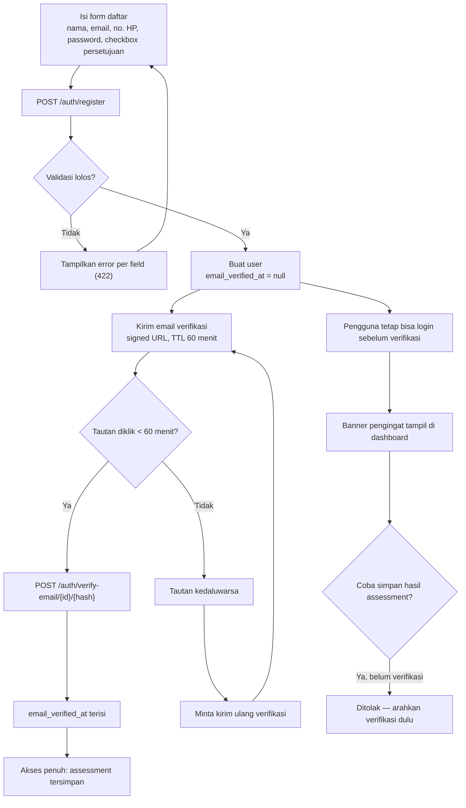
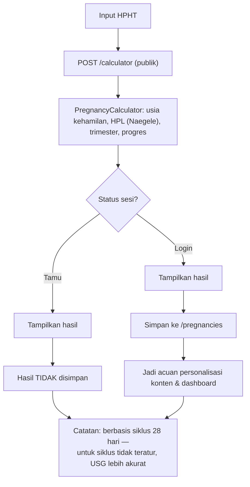
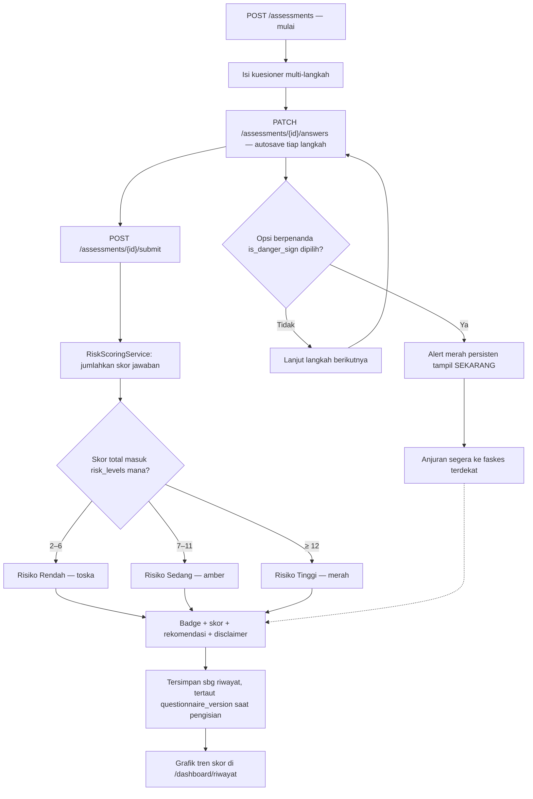
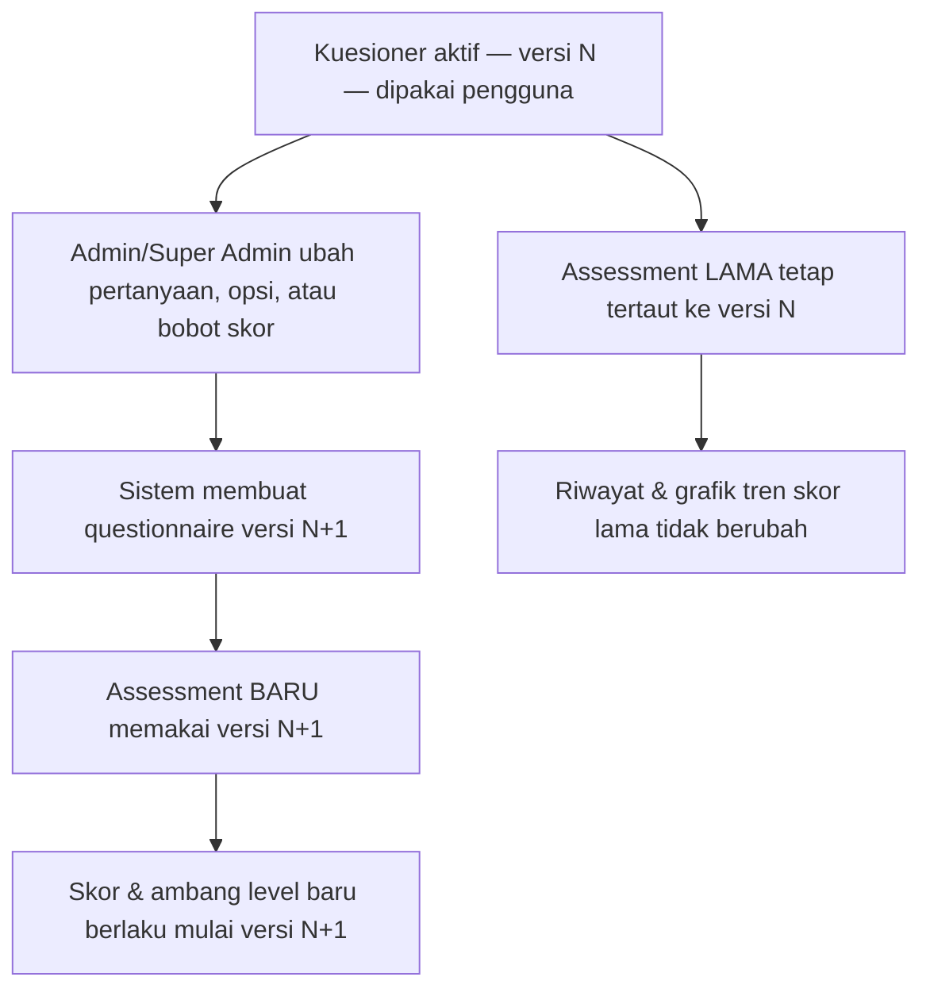
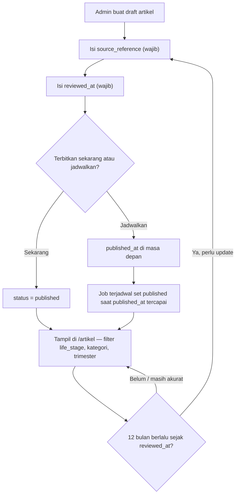
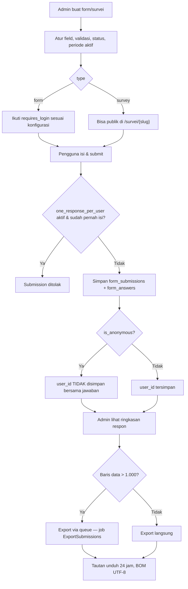
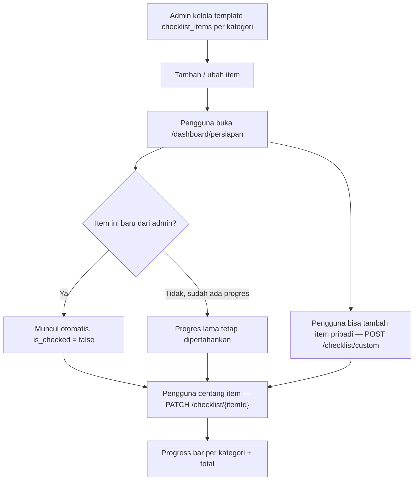
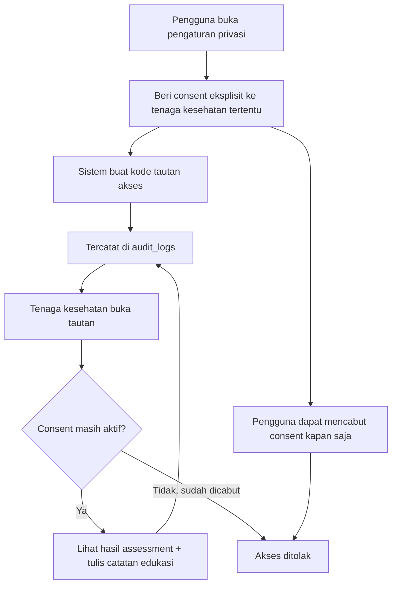

# Alur Kerja & Proses Bisnis — PrenaTalks

Pelengkap `PRD.md` dan `IMPLEMENTATION_CHECKLIST.md`. Setiap diagram menunjukkan titik keputusan sebenarnya (cabang, override, invarian data) yang dijalankan sistem, bukan sekadar mengulang langkah-langkah dari spesifikasi fitur dalam bentuk gambar.

Versi visual (rendered) tersedia sebagai artifact terpisah; dokumen ini adalah sumber teks yang disimpan bersama kode.

---

## 1. Registrasi & Verifikasi Akun

*Mengacu F-02.* Titik keputusan: apa yang boleh dilakukan pengguna sebelum email terverifikasi, dan apa yang terjadi bila tautan verifikasi kedaluwarsa.



- Login **tidak** diblokir oleh status verifikasi — yang diblokir hanya penyimpanan hasil assessment.
- Tautan kedaluwarsa tidak mengulang seluruh registrasi, hanya mengirim ulang email verifikasi.

---

## 2. Login & Refresh Token (JWT)

*Mengacu F-02, alur JWT.* Yang menjaga keamanan bukan login itu sendiri, melainkan rotasi refresh token dan tempat penyimpanan tiap jenis token.

```mermaid
sequenceDiagram
  participant B as Browser (access_token di memory)
  participant N as Next.js Route Handler
  participant L as Laravel API

  B->>L: POST /auth/login (email, password)
  L-->>B: access_token (TTL 60m) + refresh_token (TTL 14h)
  B->>N: teruskan refresh_token
  N-->>B: Set-Cookie httpOnly; Secure; SameSite=Lax
  Note over B: access_token TIDAK pernah masuk localStorage

  B->>L: Request API — Authorization: Bearer access_token
  alt access_token masih valid
    L-->>B: 200 + data
  else access_token kedaluwarsa (401)
    B->>N: minta refresh (cookie httpOnly terkirim otomatis)
    N->>L: POST /auth/refresh
    L-->>L: refresh_token lama masuk denylist
    L-->>N: access_token baru + refresh_token baru (dirotasi)
    N-->>B: access_token baru
    B->>L: ulangi request semula
    L-->>B: 200 + data
  end
```

- Refresh token lama masuk **denylist** setiap kali dipakai — mencegah token yang dicuri dipakai ulang setelah rotasi berikutnya.
- Bila refresh juga gagal, pengguna diarahkan ke `/masuk`.

---

## 3. Kalkulator Kehamilan

*Mengacu F-04.* Status sesi mengubah apakah hasil hanya ditampilkan atau juga disimpan sebagai acuan personalisasi.



- Perhitungan selalu di backend — jalur tamu maupun login memanggil endpoint yang sama, hanya penyimpanannya berbeda.

---

## 4. Cek Risiko (Risk Assessment) — Core Feature

*Mengacu F-05.* Tanda bahaya meng-override hasil skor, bukan menjadi salah satu komponen skor. Kedua jalur berjalan independen lalu bertemu di halaman hasil.



- Alert tanda bahaya tampil **terlepas dari total skor** — bisa muncul bahkan bila skor akhirnya masuk kategori rendah.
- Hasil tidak pernah memakai kata "diagnosis" atau nama kondisi medis (aturan konten, bukan aturan sistem).

---

## 5. Versioning Kuesioner Risiko

*Mengacu F-05, struktur data.* Bukan alur pengguna, melainkan invarian data: menyunting kuesioner tidak boleh mengubah makna hasil assessment yang sudah tersimpan.



- Tanpa aturan ini, mengedit satu bobot pertanyaan bisa diam-diam mengubah kategori risiko riwayat lama seorang pengguna.

---

## 6. Pengelolaan Artikel

*Mengacu F-08, siklus tinjauan tahunan di 14.5.* Dua cabang penting: jadwal terbit otomatis, dan artikel lama yang harus ditinjau ulang tiap 12 bulan.



- `source_reference` dan `reviewed_at` adalah field wajib — ini yang mewujudkan janji "berbasis bukti" di level data.

---

## 7. Form Builder, Survei & Export

*Mengacu F-06, F-07.* Tiga cabang yang saling memengaruhi: batas satu respon per pengguna, mode anonim, dan ambang volume yang menentukan export sinkron vs antrian.



- ID responden hanya ikut dalam export bila survei **tidak** anonim — konsisten dengan aturan privasi di bagian 12.3 PRD.

---

## 8. Checklist Persiapan Melahirkan

*Mengacu F-11.* Template dikelola terpusat oleh admin, tapi progres tiap pengguna tidak boleh ikut ter-reset saat template berubah.



- Item pribadi pengguna hidup berdampingan dengan item template admin di tabel progres yang sama.

---

## 9. Akses Tenaga Kesehatan (P2 — pasca-rilis)

*Mengacu F-15.* Seluruh alur bergantung pada satu syarat yang bisa berubah kapan saja: status consent — dapat dicabut kapan pun oleh pengguna.



- Pencabutan consent berlaku seketika — bukan menunggu kode tautan kedaluwarsa.

---

## Catatan Penggunaan

- Dokumen ini turunan dari `PRD.md` — bila spesifikasi fitur berubah di PRD, perbarui diagram yang relevan di sini juga.
- Untuk task implementasi per fitur, lihat `IMPLEMENTATION_CHECKLIST.md`.
